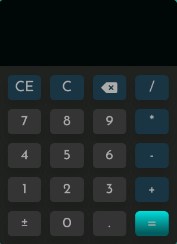

# Calculator

This is a simple calculator developed with HTML, CSS and JavaScript

## Table of contents

- [Calculator](#calculator)
  - [Table of contents](#table-of-contents)
  - [Overview](#overview)
    - [The project](#the-project)
    - [Screenshot](#screenshot)
    - [Links](#links)
  - [My process](#my-process)
    - [Built with](#built-with)
    - [What I learned](#what-i-learned)
    - [Useful resources](#useful-resources)
  - [Author](#author)

## Overview

### The project

**Instructions for use**:

- Open deploy in a web browser.
- The calculator will be displayed on the page.
- Click on the number buttons to enter the desired numbers.
- Use the mathematical operator buttons `+, -, *, /` to perform the desired operations.
- The result of the calculation will appear in the calculator display.
- To clear the display and start a new calculation, click the `C` button or the `c` key.
- To delete the current calculation and start over from scratch, click the `CE` button or the `delete` key.
- To delete one number at a time, click the `<x` button or the `backspace` key.
- To negate a number, click the `+
-` button or the `?` key.

**Note**: This calculator is for educational purposes only, and does not have all the functionality of a full calculator.

### Screenshot

### Links

- [Live Site URL]()

## My process

### Built with

- Semantic HTML5 markup
- CSS custom properties
- Flexbox
- Grid
- Javascript

### What I learned

I had a little difficulty with javascript, however, I was able to create the project without copying from a tutorial and that was very motivating for me.

### Useful resources

- [MDN](https://developer.mozilla.org/pt-BR/)
- [W3Schools](https://www.example.com)
- [Geeks for Geeks](https://www.geeksforgeeks.org/javascript-array-reference/)

## Author

- [Website](https://levymatias.github.io/Portfolio/index.html)
- [Linkedin](https://www.linkedin.com/in/levy-matias/)
